<p align="center">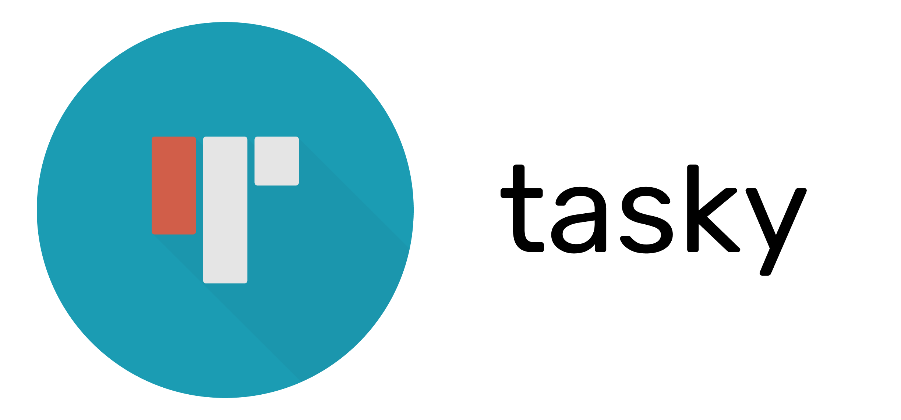</p>

<p align="center">
<a href="https://github.com/Supercaly/ASPDM-Project/actions"></a>
<a href="https://codecov.io/gh/Supercaly/ASPDM-Project"></a>
</p>

**Nome:** Lorenzo Calisti

**Matricola:** 307458

# Tasky

Tasky è un'applicazione pensata per gestire e tenere traccia dell'andamento dei progetti all'interno di una azienda o un ufficio.

L'applicazione permette ai propri utenti di creare un piccolo promemoria,detto ***task***, e di vedere i task creati dai propri colleghi. Un task è composto da un *titolo*, una *descrizione*, una *data di scadenza*, delle *label*, dei *membri* e delle *checklist*, tutti elementi molto utili per tenere traccia delle cose sa fare o di vari problemi riscontrati nella propria area di lavoro. 

Un esempio di task per cui tasky è stata pensata è quello di indicare la realizzazione di una determiata funzionalità a cui la compagnia sta lavorando; in queso caso torna molto utile poter inserire una data di scadenza entro la quale il lavoro dev'essere completato, delle label per marcare l'alta priorità del progettoe una lista di utenti **membri** indicati come i responsabili di questa feature, inoltre è possibile inserire una o più checklist con delle liste di cose da fare che possono essere spuntate man mano che il lavoro procede. Infine, sapendo quanto i feedback dei propri colleghisiano importanti, ogni utente ha la possibilità di aggiungere un proprio commento sotto ogni task, creando un area di discussione vera e propia.

## Getting Started

Prima di scaricare e compilare il progetto è importante prendere nota dei seguenti requisiti:

### Versione di flutter

L'applicazione è stata progettata e testata utilizzando flutter con il canale `beta` alla versione `1.26.0-17.3.pre`. Per ottenere la corretta versione di flutter eseguire i seguenti comandi nel terminale:
```console
$ flutter channel beta
$ flutter upgrade
```
### Code generation

L'applicazione fa utilizzo di pacchetti che richiedono la generazione di codice per funzionare, per facilitare questa parte sono stati creati degli script che automatizzano il processo.

**Linux:**
```console
$ ./scripts/linux/generate_colors.sh
$ ./scripts/linux/generate_model.sh
$ ./scripts/linux/generate_icons.sh
```
**Windows:**
```console
> ./scripts/windows/generate_colors.bat
> ./scripts/windows/generate_model.bat
> ./scripts/windows/generate_icons.bat
```

### Nota per il web

A volte quando si prova ad eseguire l'applicazione utilizzando flutter web può succedere di incappare nel seguente errore:

```
Attempting to connect to browser instance..
Finished with error: Failed to establish connection with the application instance in Chrome.
This can happen if the websocket connection used by the web tooling is unabled to correctly establish a connection, for example due to a firewall.
```

Questo è dovuto ad un [bug](https://github.com/flutter/flutter/issues/49482) di flutter web che spesso si risolve ri-eseguendo il progetto nuovamente oppure compilandolo in modalità di release con il comando `flutter run -d web --release`.

### Credenziali

Per utilizzare l'applicazione è richiesa una coppia email/password; per testare l'applicazione è possibile utilizzare uno qualsiasi dei segueni account già presenti del database:

| Email                | Password |
| -------------------- | -------- |
| djonline96@gmail.com | 1234     |
| jon.doe@gmail.com    | jondoe21 |

## Casi d'uso e Interfaccia Utente

Durante il primo avvio all'utente è mostrata la **pagina di login**, qui è possibile inserire la propria email e password. In caso i dati forniti non siano corretti è mostrato un messaggio d'errore altrimenti l'utente è trasportato nella pagina home e i suoi dati d'accesso sono salvati per il prossimo accesso. 

<p align="center">
    
</p>

La **pagina home** è il componente principale dell'applicazione, qui è possibile vedere in forma breve tutti i task creati dagli utenti

<p align="center">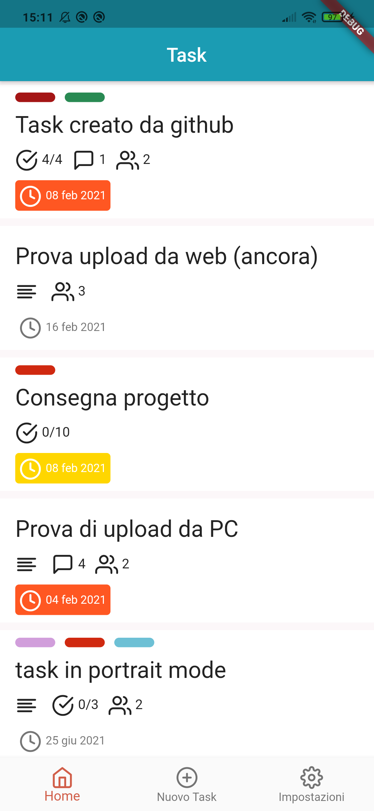</p>

Premendo l'icona settings nella barra di navigazione inferiore l'utente è portato nella **pagina delle impostazioni**; qui potrà vedere le informazioni sul suo account ed eventualmente eseguire il logout; qui inoltre potrà aprire le impostazioni di notifica del suo sistema operativo, consultare la lista di tutti i task archiviati oltre avere accesso all'easter-egg e a più informazioni sull'applicazione in generale.

<p align="center">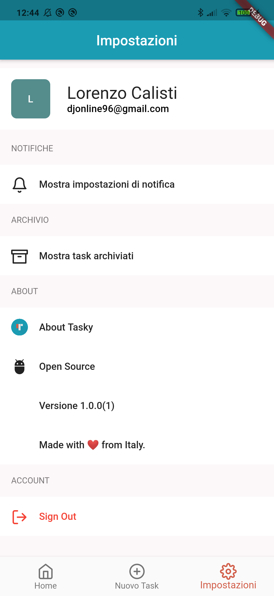</p>

Aprendo la **pagina archivio** l'utente ha accesso a tutti quei task che sono stati precedentemente marcati come archiviati. In Tasky, per scelta di progetto, l'eleminazione di un task non è possibile così l'unico modo in cui si può segnare un task come completato è archiviarlo. L'interfaccia utente di questa pagina è del tutto analoga a quella della pagina home.

<p align="center">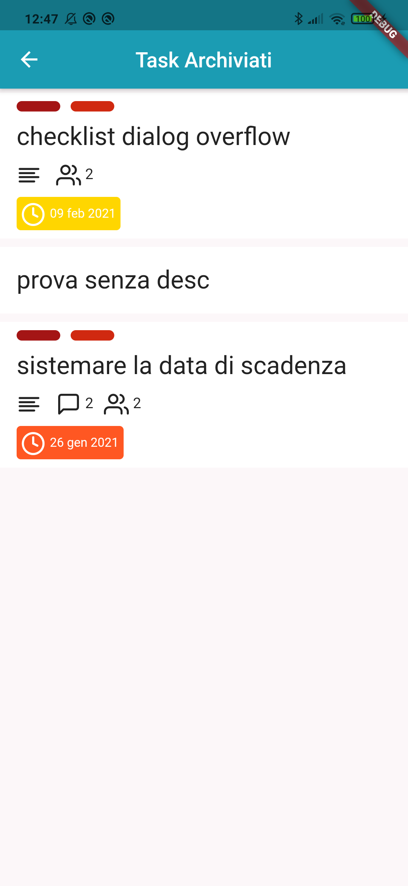</p>

Premendo l'icona centrale nella barra di navigazione la pagina **nuovo task** si apre sopra la pagina corrente, qui l'utente potrà creare un nuovo task inserendo il titolo, la descrizione, la data di scadenza, le etichette, i membri e le checklist. 

Una particolarità del design di questa pagina sono le diverse bottom sheet e pagine che si aprono per scegliere le label, i membri e le checklist.

Premendo il bottone *CREATE* nella pagina superiore il task verrà caricato e da quel momento potrà essere visto da tutti gli utenti nella schermata home.

<p align="center"></p>

Quando l'utente preme su un determinato task la **pagina di informazioni di un task** si apre sopra la pagina corrente, qui è possibile avere una vista completa su tutti gli elementi di quello specifico task. 

L'app bar di questa pagina cambia a seconda dell'utente attualmente registrato: se l'utente è il creatore del task oppure è uno dei membri troverà un bottone **condividi**, un bottone **modifica** e un bottone **archivia**, antrimenti solo il bottone **condividi** sarà mostrato. Un task può essere archiviato e modificato solo dall'utente che lo ha creato e da tutti gli utenti segnati come membri.

<p align="center">
    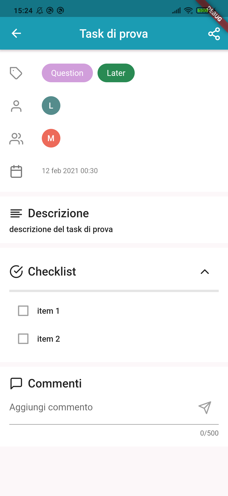
    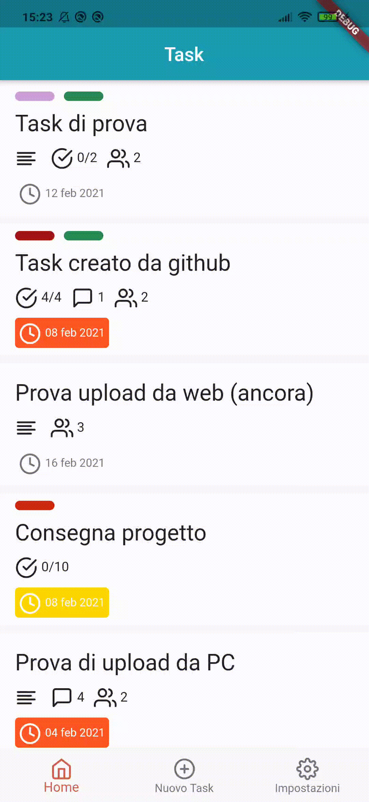
</p>

Se si preme il bottone *modifica* la **pagina di modifica del task** verrà aperta, questa pagina è del tutto analoga a quella **nuovo task** (infatti in termini implementativi è la stessa pagina), l'unica differenza è che tutti i campi sono pre compilati con i valori del task che si vuole modificare per rendere più semplice la modifica; il bottone *CREATE* è stato sostituito da *UPDATE* che, se lo si preme, salverà le modifiche fatte su quel task.

<p align="center">
    
</p>

In fondo alla pagina di informazioni sul task si trova una sezione dedicata ai commenti; qui l'utente può vedere i commenti degli altri utenti, creare uno nuovo e modificare i suoi vecchi commenti.

Ogni commento che è stato creato dall'utente attualmente connesso avrà nella parte destra un icona *more* premendola si aprirà un menu a tendina che dà all'utente la possibilità di **modificare** o **cancellare** quel commento.

<p align="center">
    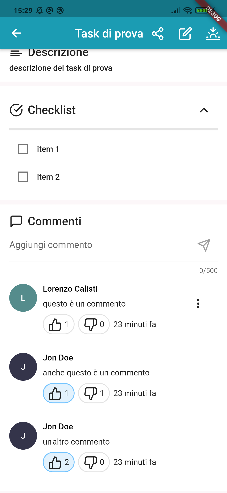
</p>

## Tecnologia

Per lo sviluppo del progetto si è scelto di utilizzare alcuni concetti del Domain Driven Design (DDD). 
> Il DDD è un approccio dello sviluppo del software che risolve problemi complessi connettendo l'implementazione ad un modello in evoluzione. Le premesse del domain-driven sono le seguenti:
> 1. Puntare il focus primario del progetto sui domini delle entità e la loro logica.
> 2. Basare il design sulle entità di dominio.
> 3. Iniziare una creativa collaborazione tra tecnici ed esperti di dominio per definire in maniera iterativa un modello concettuale che possa essere applicato ai particolari problemi del caso.

Il diagramma seguente mostra ci componenti architetturali principali presenti in un'applicazione che segue il DDD.

<p align="center">
    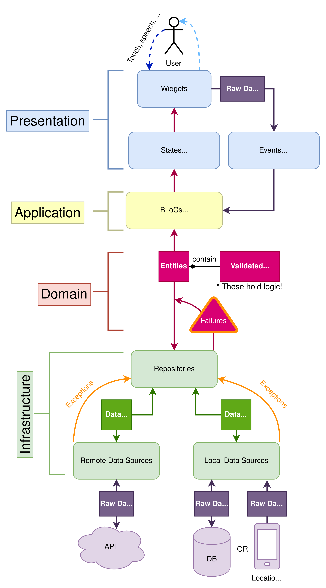
</p>

### Presentation

Partendo dall'alto il primo layer che si incontra è il **presentation layer**, questo è composto solo da Widget Flutter; in sostanza presentation è il layer che contiene tutto il codice della UI. 

<p align="center">
    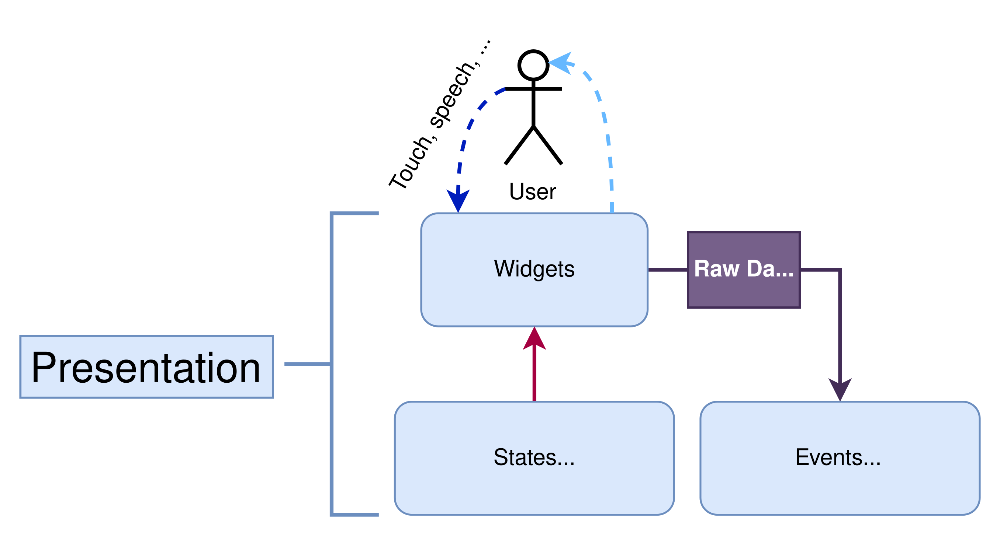
</p>

Seguendo il DDD la UI diventa la parte più "stupida" dell'applicazione, questo perché il suo unico scopo è quello di ricevere dei dati dai layer sottostanti e mostrarli all'utente con un interfaccia "accattivante". Quando una logica riguarda dei dati che saranno poi inviati ad un server o salavati in locale quella logica non ha nulla a che vedere con il presentation layer, mentre quindi qui è possibile trovare gli statidegli `StatefullWidget` persino cose semplici come la validazione dei form non è contenuta in questo layer.

### Application

L'unico compito di questo layer è quello di gestire tutti gli altri layer; la sua funzione è quella di decidere cosa fare con i dati una volta che sono generati. I dati generati dall'input utente devono essere validati, mentre i dati provenienti dal server o dallo storage locale devono essere passati al presentation layer per essere mostrati.

<p align="center">
    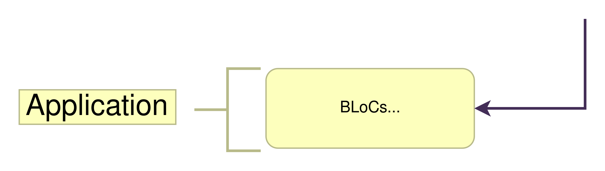
</p>

Nell'applicazione per gestire lo stato in questo layer si è scelto si utilizzare il pattern BLoC implementato dal pacchetto [bloc](https://github.com/felangel/bloc), in particolare una sua funzionalità chiamata `Cubit`.

Un Cubit è uno componente che gestisce uno stato interno utilizzando gli `Stream`; utilizzano le funzioni del cubit per scatenare cambiamento di stato si ottengono i dati.

### Domain

Il **domain layer** è il cuore dell'applicazione, è l'unico layer che ha dipendenze con l'esterno, ma tutti gli altri layer dipendono da lui. Nel domain layer risiede tutta la *logica di buisness*. Qui troviamo:

* le **entità**
* la **validazione dei dati**
* la **gestione dei fallimenti**

<p align="center">
    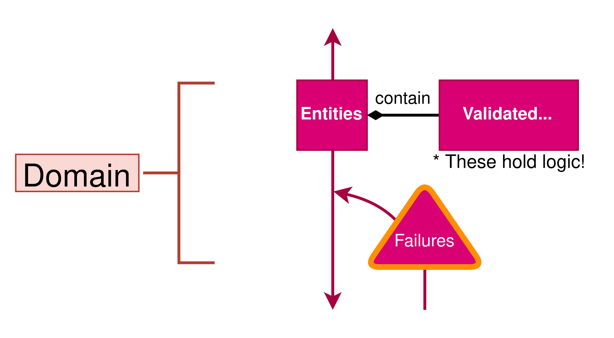
</p>

Le entità sono oggetti unicamente identificati formati dal raggruppamento di dati che hanno caratteristiche in comune, ad esempio l'entità `User`, `Task` e `Label`.

I dati vengono validati e mantenuti validi utilizzando i `ValueObject`, al posto di salvare l'indirizzo email di un utente come una `String` si utilizza un oggetto `EmailAddress` che internamente contiene una stringa, ma si assicura che essa sia un valido indirizzo email ogni volta che subisce delle modifiche; analogamente `TaskTitle` rappresenta il tipolo di un task che è valido solo se la stringa che contiene non è vuota e più lunga di un certo limite.

Gestire il fallimento di un metodo può risultare complesso, per questo motivo nell'applicazione si è fatto uso della classe `Failure`; questa classe utilizza il concetto della union per esprimere tutti i tipi di fallimento possibili nell'applicazione, in questo modo quando si chiama un metodo non servirà più gestire le eccezioni con un `try/catch`, ma sarà il metodo stesso a ritornare il dato desiderato oppure un fallimento. Un esempio di questo sono i metodi che prendono i dati dal server ritornando il dato cercato oppure un istanza di `ServerFailure`.

### Infrastructure

L'ultimo layer che si incontra è **l'infrastructure layer**, il suo scopo è quello di gestire l'origine dei dati preoccupandosi di comunicare con le API locali e remote.

<p align="center">
    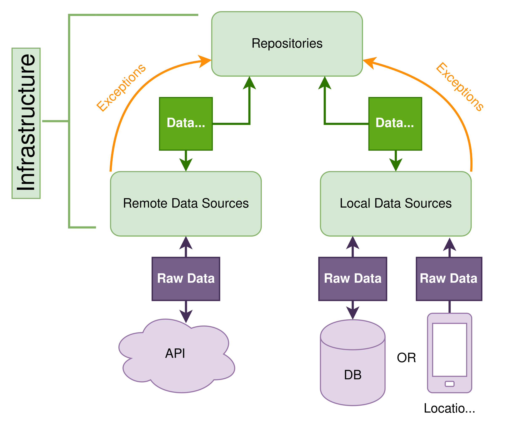
</p>

Questo livello è diviso in due parti: **repository** e **data source**, le repository hanno il compito di fare da confine fra il "mondo esterno" e il domain/application layer gestendo le `Exception` dei data source e ritornando i dati o i `Failure`. I data source invece operano più a basso livello chiamando le spscifiche API per richiederei i dati ai server remoti o locali. I **modelli** (nel diagramma chiamati Data Transfer Objects) sono il collegamento fra i data source e le repository, il loro scopo è quello di convertire i dati dal formato JSON (usato nelle API) in entità e value object del domain layer.

TODO: Aggiungere la descrizione del server

### Service

Al difuori dei layer descritti nel DDD troviamo i **service**, i servizi sono classi che rappresentano una particolare funzionalità di Flutter che non ha nulla a che vedere con la gestione diretta dello stato, per questo motivo non è all'interno di un layer. Fra questi servizi troviamo:

* `LogService` un wrapper attorno alla funzione print nativa di Flutter che consente di stampare log sulla console in maniera più bella e utilizzando diversi livelli di log (debug, info, error, ...)
* `NavigationService` un wrapper attorno al `Navigator` nativo di Flutter
* `AppInfoService` classe che consente l'accesso alle informazioni base dell'applicazione: versione e numero di build
* `ConnectivityService` una classe che consente di ascoltare i cambiamenti nello stato della connessione ad internet del dispositivo im moda da poter mostrare un messaggio di avvertimento in caso il dispositivo sia offline
* `PreferenceService` wrapper attorno alle `SharedPreferences` che consente di salavre nelle preferenze del dispositivo l'utente durante il login
* `NotificationService`/`LinkService` la loro funzione è quella di ricevere i messaggi di notifica o di apertura di un dynamic link e mostrare la pagina di informazioni con il task corretto.

### Core

Core è un package che contiene alcune classi usate in tutto il progetto.
Quste classi implementano alcuni concetti derivati dalla pprogrammazione funzionale.

La classe `Maybe` contiene un valore opzionale rappresentato come:

* la presenza di un valore, detto `Just`
* l'assenza di un valore, detta `Nothing`

La classe `Either` rappresenta un oggetto che può avere due possibili valori:

* un valore corretto, detto `Right`
* un valore d'errore, detto `Left` 

Either è utilizzata nel progetto come valore di ritorno nei metodi delle reporitoty e di data source poichè può contenere un valore corretto e uno di tipo `Failure`. Either è utilizzato anche all'interno dei `ValueObject` per contenere il valore validato oppure un'istanza di `ValueFailure` che rappresenta un valore non valido.

La classe `MonadTask` è un wrapper attorno ad un `Future<Either<L, R>>` utilizzata nelle repository per facilitare la gestione delle eccezioni tramite metodi come `map` e `attempt`.

La classe `IList` implementa una versione **immutabile** delle liste native dart; al suo interno contiene metodi come `append`, `remove` e `map` che ritornano sempre una nuova lista modifcata. Questa lista è utilizzata nelle entità per impedire la modifica dei valori interni, a differenza delle liste native di dart.

## Pacchetti aggiuntivi

- `provider` 
- `get_it` libreria di dependency injection utilizzata per fornire i servizi all'intera applicazione senza il bisogno di un context
- `flutter_bloc` 
- `equatable` libreria che facilita 
- `dio`
- `firebase_messaging`
- `firebase_dynamic_links`
- `loading_overlay`
- `easy_colors`